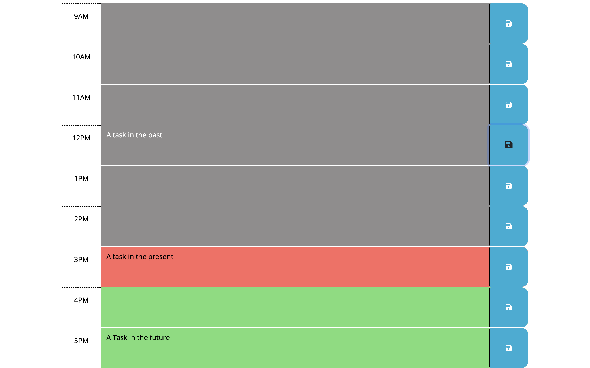

# Work Day Scheduler App

## Project Intro
We live in an increasingly busy world where staying organized and knowing what events and tasks have been scheduled for the day can be incredibly difficult. This app is designed for the busy professional or student to help keep a record of important daily tasks and plan for the future. 

## Project Goals
Simplicity, clarity, and ease of UI/UX were the primary goals for this application. 

## Project Features
```
When the user enters the app, they are able to see the current day and time displayed at the top of the calendar.
There is a color legend to tell you which time blocks are in the past, present, or future.
Each of the timeblocks is color coded and the user can input information into each timeblock.
There is a button that will clear the schedule on the page and clear the local storage.
```


```
When the user inputs a task into a timeblock, they are able to save the information for future recall.
The inputted information is saved in local storage and persists after the browser is closed.
```


## Link to Live Site


